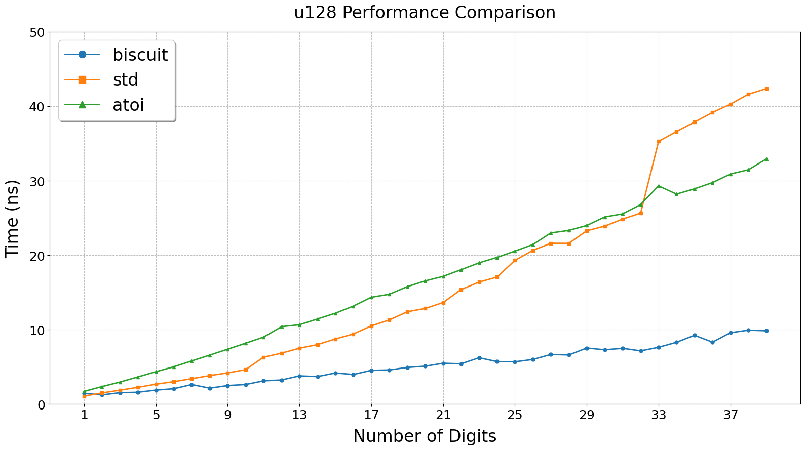
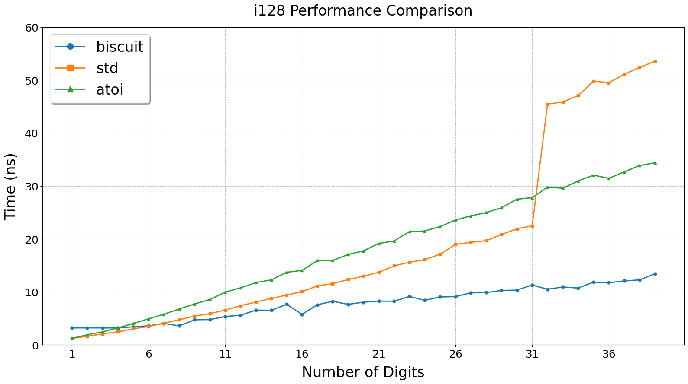
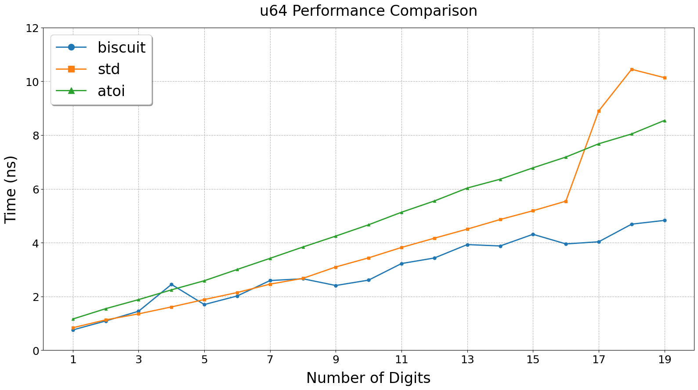
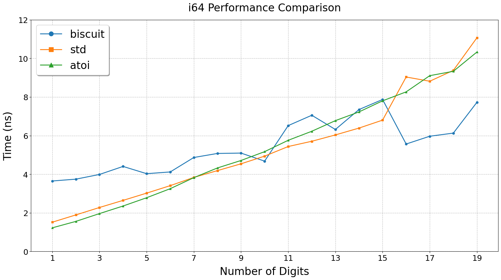
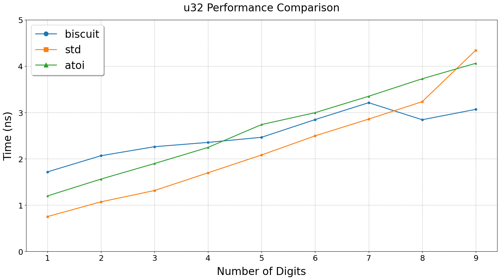
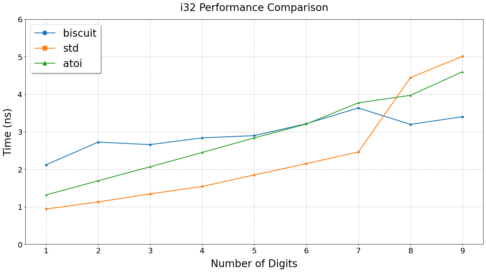

# biscuit-converter

biscuit-converter is a decimal integer parser using bitwise operations.


## Usage

Add this to your `Cargo.toml`:

```toml
[dependencies]
biscuit-converter = "0.3"
```

Then, use it in your Rust code:

```rust
use biscuit_converter::{Biscuit, error::ParseIntErr};

let val = i32::parse_decimal(b"1234");
assert_eq!(val, Ok(1234));

let val = i32::parse_decimal(b"1234a");
assert_eq!(val, Err(ParseIntErr::NonDecimal));

let val = i32::parse_decimal(b"a1234");
assert_eq!(val, Err(ParseIntErr::NonDecimal));

let val = i32::parse_decimal(b"");
assert_eq!(val, Err(ParseIntErr::Empty));

let val = i32::parse_decimal(b" ");
assert_eq!(val, Err(ParseIntErr::NonDecimal));

let val = i32::parse_decimal(b"2147483647"); // i32::MAX
assert_eq!(val, Ok(2147483647));

let val = i32::parse_decimal(b"2147483648"); // i32::MAX + 1
assert_eq!(val, Err(ParseIntErr::Overflow));

let val = i32::parse_decimal(b"-2147483648"); // i32::MIN
assert_eq!(val, Ok(-2147483648));

let val = i32::parse_decimal(b"-2147483649"); // i32::MIN - 1
assert_eq!(val, Err(ParseIntErr::NegOverflow));

let reading = i32::parse_decimal(b"0000000000000000000000000000000000000123");
assert_eq!(reading, Ok(123));
```

## Performance
* Comparisons: `biscuit` & `std` & `atoi`
* Key Features:
  * Overall, `biscuit-converter` demonstrates superior performance compared to other parsers for unsigned types.
  * For signed types, significant performance improvements are only observed with longer digit lengths.

* Test machine: Ryzen 7 7700 3.8Ghz, rust 1.79
* Configurations:

```toml
[profile.release]
opt-level = 3
lto = "fat"
codegen-units = 1
```
```cmd
set RUSTFLAGS=-C target-cpu=native && cargo bench
```

### `u128` comparisons


### `i128` comparisons


### `u64` comparison


### `i64` comparison


### `u32` comparison


### `i32` comparison



## License

This project is licensed under either of

- Apache License, Version 2.0, (http://www.apache.org/licenses/LICENSE-2.0)
- MIT license (http://opensource.org/licenses/MIT)

at your option.

## Contributions

We welcome all kinds of contributions! Whether it's bug reports, feature requests, or code contributions, 
your input is valuable and appreciated. Feel free to open issues or submit pull requests on our GitHub repository.